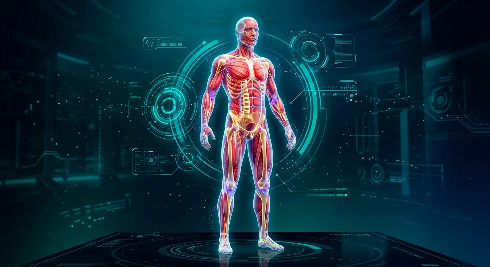

# Anatomía XR

App web de realidad aumentada que proyecta **músculos**, **huesos**, **ligamentos** y **tendones** sobre tu cuerpo en tiempo real usando la cámara.

Todo el tracking corre **en tu dispositivo** (MediaPipe Pose). No se sube ningún video.



## Características

- Cámara en vivo + detección de pose (33 landmarks)
- 5 capas: Músculos · Huesos · Ligamentos · Tendones · Todo
- Overlay procedural con glow, fibras, rótulas y etiquetas en español
- Placas visuales generadas / regenerables con **Higgsfield Soul v2**
- Controles de opacidad, glow, guía ósea, nombres y captura de foto
- UI estilo HUD / sci-fi, responsive

## Inicio rápido

```bash
npm install
npm run dev
```

Abre la URL local (o el preview), pulsa **Activar cámara** y colócate a cuerpo completo frente a la cámara.

## Demo publicada

👉 **https://ojperdomoc.github.io/Anatomia2_XAR/**

Se publica sola en cada push a `main` con GitHub Actions
(`.github/workflows/deploy-pages.yml`). También puedes lanzarla a mano desde la
pestaña **Actions → Deploy to GitHub Pages → Run workflow**.

Requisito de una sola vez: en **Settings → Pages → Build and deployment**, la
opción *Source* debe estar en **GitHub Actions**.

El build detecta que corre en Actions y prefija los assets con `/Anatomia2_XAR/`
(ver `vite.config.js`); en local se sigue usando `/`. Para replicar el build de
producción en tu máquina:

```bash
GITHUB_ACTIONS=true GITHUB_REPOSITORY=Ojperdomoc/Anatomia2_XAR npm run build
```

## Generar assets con Higgsfield

Las texturas de `public/assets/` se pueden regenerar con la API de [Higgsfield](https://docs.higgsfield.ai/docs):

```bash
export HF_API_KEY_ID=tu_key_id
export HF_API_KEY_SECRET=tu_key_secret
npm run generate:assets
```

Sin credenciales, el proyecto ya incluye placas procedurales (`npm run` no las necesita) creadas con:

```bash
node scripts/make-placeholders.mjs
```

## Stack

| Pieza | Tecnología |
|--------|------------|
| UI | HTML · CSS · Vite |
| Pose | MediaPipe Tasks Vision (`pose_landmarker_lite`) |
| Overlay | Canvas 2D procedural |
| Assets AI | Higgsfield Soul v2 (`scripts/generate-higgsfield.mjs`) |

## Estructura

```
├── index.html
├── public/assets/          # placas musculares / óseas / etc.
├── scripts/
│   ├── generate-higgsfield.mjs
│   └── make-placeholders.mjs
└── src/
    ├── main.js             # cámara + MediaPipe + UI
    ├── anatomy.js          # mapa anatómico → landmarks
    ├── renderer.js         # dibujo de capas
    └── style.css
```

## Privacidad

- La cámara solo se usa en el navegador.
- MediaPipe corre en WASM/GPU local.
- Higgsfield se usa **offline** (script de build), nunca con el stream de video.

## Licencia

Proyecto educativo / demo.
